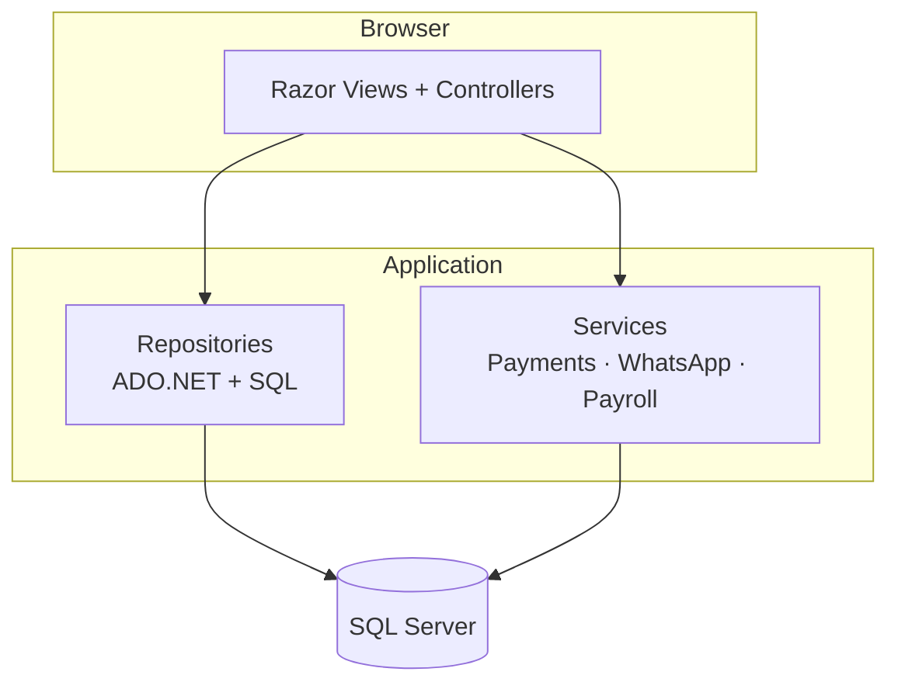

# CloudMex Gym Management System

> All-in-one gym ERP — members, staff, attendance, payroll, inventory, reports, online payments & WhatsApp lead bot.

[](https://dotnet.microsoft.com/)
[](https://dotnet.microsoft.com/apps/aspnet)
[](https://www.microsoft.com/sql-server)

---

## Features

| Area | Highlights |
|------|------------|
| **Members** | Registration, plans, attendance, payments, expiry tracking |
| **Staff & Payroll** | Staff master, attendance, salary rules, processing, bank statements |
| **Operations** | Leads CRM, trainer assignment, workout & diet plans, PT sessions |
| **Inventory** | Products, vendors, stock purchase & issue, equipment maintenance |
| **Finance** | Expenses, collections, profit/loss reports |
| **Payments** | Paytm, PhonePe, Razorpay, Cashfree (sandbox & production) |
| **WhatsApp** | SmartPing API, lead bot, public join form, webhook |

---

## Tech stack

| Layer | Technology |
|-------|------------|
| Backend | ASP.NET Core 9 MVC |
| Data | ADO.NET + raw SQL (`Data/Queries`, `Data/Repositories`) |
| Database | Microsoft SQL Server |
| Auth | Session login + BCrypt + role-based permissions |
| UI | Bootstrap 5, jQuery, Font Awesome, SweetAlert2 |
| Export | ClosedXML (Excel), CSV import/export |

**NuGet:** `BCrypt.Net-Next` · `ClosedXML` · `Microsoft.Data.SqlClient` · `Microsoft.AspNetCore.Mvc.Razor.RuntimeCompilation`

---

## Quick start

### Prerequisites

- [.NET 9 SDK](https://dotnet.microsoft.com/download)
- SQL Server (Express or full) + [SSMS](https://aka.ms/ssms)
- Visual Studio 2022 or VS Code

### 1. Clone & restore

```bash
git clone <your-repo-url>
cd GymManagementSystem/GymManagementSystem
dotnet restore
```

### 2. Connection string

Edit `appsettings.json`:

```json
{
  "ConnectionStrings": {
    "DefaultConnection": "Server=YOUR_SERVER\\SQLEXPRESS;Database=GymManagement;Trusted_Connection=True;TrustServerCertificate=True"
  }
}
```

### 3. Database (one script)

Open **SSMS** → run the full script:

```
GymManagementSystem/Database/Full_Database.sql
```

This creates the database, all tables, permissions, and seed data. Safe to re-run on existing DB (idempotent checks).

### 4. Admin user

Generate a BCrypt hash (C# interactive or small console app):

```csharp
BCrypt.Net.BCrypt.HashPassword("YourPassword123");
```

Then in SSMS:

```sql
INSERT INTO UserMasters (FullName, UserName, PasswordHash, RoleId, IsActive)
VALUES (N'Super Admin', N'admin', N'<paste_bcrypt_hash>', 1, 1);
```

`RoleId = 1` is **Super Admin** (full access).

### 5. Run

```bash
dotnet run
```

| URL | Purpose |
|-----|---------|
| http://localhost:5052 | Home |
| http://localhost:5052/Account/Login | Staff login |
| http://localhost:5052/Dashboard/Index | Dashboard |

---

## Configuration

**File:** `GymManagementSystem/appsettings.json`

| Section | Purpose |
|---------|---------|
| `ConnectionStrings:DefaultConnection` | SQL Server |
| `Paytm` / `PhonePe` / `Razorpay` / `Cashfree` | Gateway API base URLs |
| `WhatsApp:*` | Fallback settings (DB overrides in production) |
| `Gym:Name` / `Gym:Address` | Salary & bank statement headers |

**Admin UI (recommended for production):**

- **Masters → Payment Gateway** — gateway keys (encrypted)
- **Masters → WhatsApp API Setup** — SmartPing: Phone Number ID, WABA ID, API Key

Session idle timeout: **30 minutes** (`Program.cs`).

---

## Architecture



**Patterns:** repository per module · `[Permission]` RBAC filter · `PaymentProviderFactory` for gateways · WhatsApp settings from DB first, `appsettings.json` fallback.

---

## Modules

<details>
<summary><strong>Masters</strong> (14 modules)</summary>

| Menu | Route | Permission |
|------|-------|------------|
| Membership Plans | `/MembershipPlans/Index` | MembershipPlans |
| Member Master | `/MemberMasters/Index` | MemberMaster |
| Staff Master | `/StaffMasters/Index` | StaffMaster |
| Exercise Master | `/Exercise/Index` | ExerciseMaster |
| Diet Master | `/DietMaster/Index` | DietMaster |
| Class Master | `/ClassMaster/Index` | Classes |
| Equipment | `/EquipmentMaster/Index` | Equipment |
| Products | `/Products/Index` | Products |
| Vendors | `/Vendors/Index` | Vendors |
| Expense Heads | `/ExpenseHeads/Index` | ExpenseHeads |
| Payment Gateway | `/PaymentGateway/Index` | PaymentGateway |
| WhatsApp API Setup | `/WhatsAppApiSetup/Index` | WhatsAppApiSetup |
| Lead Sources | `/LeadSources/Index` | LeadSources |
| Users & Roles | `/UsersRoles/Index` | UsersRoles |

</details>

<details>
<summary><strong>Entries</strong> (16 modules)</summary>

| Menu | Route | Permission |
|------|-------|------------|
| Membership Management | `/MembershipManagement/Index` | MembershipManagement |
| Attendance | `/Attendance/Index` | Attendance |
| Payments | `/Payments/Index` | Payments |
| Leads | `/Leads/Index` | Leads |
| WhatsApp Bot | `/WhatsAppBot/Index` | Leads (View) |
| Trainer Assignment | `/TrainerAssignments/Index` | TrainerAssignment |
| Workout Plans | `/WorkoutPlans/Index` | WorkoutPlans |
| Diet Plans | `/DietPlans/Index` | DietPlans |
| PT Sessions | `/PTSessions/Index` | PTSessions |
| Class Booking | `/ClassBooking/Index` | ClassBookings |
| Stock Purchase | `/StockPurchase/Index` | StockPurchase |
| Stock Issue | `/StockIssue/Index` | StockIssue |
| Equipment Maintenance | `/EquipmentMaintenance/Index` | EquipmentMaintenance |
| Expenses | `/Expenses/Index` | Expenses |
| Staff Attendance | `/StaffAttendance/Index` | StaffAttendance |
| Salary Processing | `/SalaryProcessing/Index` | SalaryProcessing |
| Payroll Hub | `/Payroll/Index` | Payroll |

</details>

<details>
<summary><strong>Reports & members</strong></summary>

| Menu | Route | Permission |
|------|-------|------------|
| Members | `/Members/Index` | Members |
| Attendance Report | `/Reports/Attendance` | ReportAttendance |
| Membership Expiry | `/Reports/MembershipExpiry` | ReportExpiry |
| Collections | `/Reports/Collections` | ReportCollections |
| Outstanding | `/Reports/Outstanding` | ReportOutstanding |
| Profit / Loss | `/Reports/ProfitLoss` | ReportProfitLoss |

</details>

---

## Authentication & RBAC

1. Login at `/Account/Login` → BCrypt verify against `UserMasters`
2. Session stores `FullName`, `UserName`, `RoleId`
3. `[Permission("ModuleName", "View|Add|Edit|Delete")]` on controllers
4. **RoleId = 1** bypasses all permission checks
5. Sidebar uses `PermissionHelper.CanView()`

**Tables:** `RoleMaster` · `PermissionMaster` · `RolePermission` · `UserMasters`

---

## Online payments

**Supported gateways:** Paytm · PhonePe · Razorpay · Cashfree

```
Payments → Pay Online → /OnlinePayment/Checkout → Gateway → Callback → DB
```

**Public callbacks:** `/OnlinePayment/PaytmCallback` · `PhonePeCallback` · `RazorpayCallback` · `CashfreeCallback` · `CashfreeReturn`

Member fees and salary online pay both use the same checkout flow.

---

## WhatsApp (SmartPing)

**Setup:** Masters → WhatsApp API Setup

| Field | Required |
|-------|----------|
| Phone Number ID | Yes |
| WABA ID | Yes |
| API Key | Yes |

**Webhook URL:** `https://your-domain.com/api/whatsapp/webhook`  
Local dev: use [ngrok](https://ngrok.com/) → `ngrok http 5052`

**Public join flow:** `/join` → lead created → bot conversation → plan selection → `/Pay/Lead?token=...` → payment → conversion

---

## Public routes (no login)

| Route | Description |
|-------|-------------|
| `/Account/Login` | Staff login |
| `/join` | Public lead form |
| `/Pay/Lead?token=` | Lead payment |
| `/OnlinePayment/Checkout` | Payment UI |
| `/api/whatsapp/webhook` | WhatsApp webhook (GET verify / POST messages) |
| `/Home/AccessDenied` | Permission denied |

---

## Project structure

```
GymManagementSystem/
├── GymManagementSystem.sln
├── README.md
└── GymManagementSystem/
    ├── Controllers/          # MVC controllers
    ├── Views/                # Razor views
    ├── Models/               # Domain models
    ├── ViewModels/
    ├── Data/
    │   ├── Queries/          # SQL strings
    │   ├── Repositories/     # ADO.NET data access
    │   └── DbHelper.cs
    ├── Services/             # Payments, WhatsApp, payroll, CSV
    ├── Helpers/              # Permission filter, export helpers
    ├── Database/
    │   └── Full_Database.sql # ⭐ Single full DB script
    ├── wwwroot/              # CSS, JS, uploads
    ├── appsettings.json
    └── Program.cs
```

**Incremental SQL scripts** (`Database/*.sql`) are kept for partial upgrades; fresh installs should use `Full_Database.sql` only.

---

## Troubleshooting

| Problem | Fix |
|---------|-----|
| Build — file locked | Stop running app, then `dotnet build` |
| DB connection failed | Check SQL Server service, server name, `TrustServerCertificate=True` |
| Login failed | User exists in `UserMasters`, `IsActive = 1`, valid BCrypt hash |
| Menu missing | Run `Full_Database.sql` or grant permissions in Users & Roles |
| Payment save failed | Key ID + Secret required; match sandbox/production environment |
| WhatsApp not sending | Enable API in setup, test connection, verify webhook + ngrok for local |

---

## License

Internal / proprietary — CloudMex Gym Management System.
